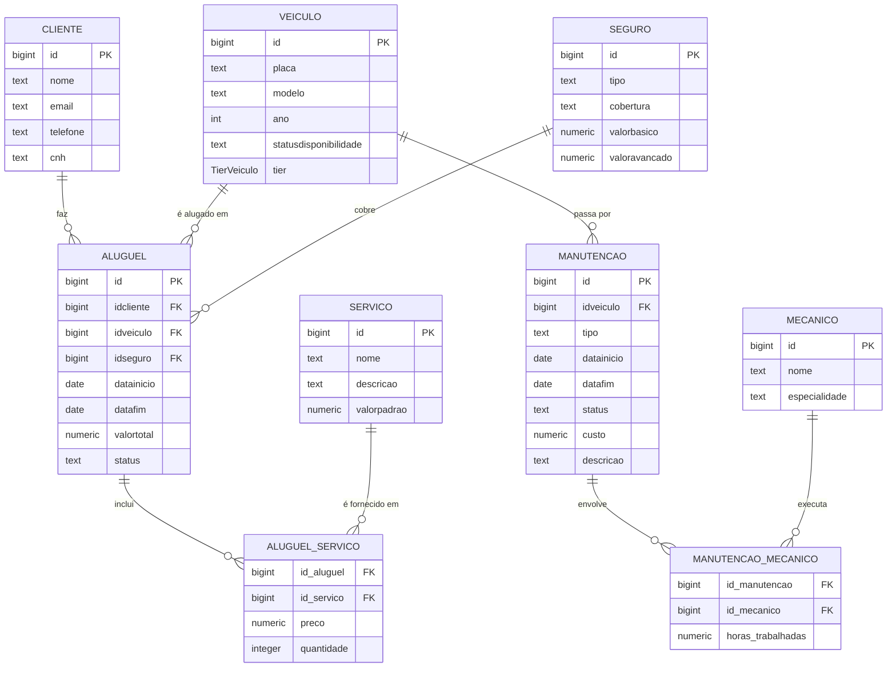

# MyMove_DB

Banco de dados e gerador de dados para uma locadora de veículos utilizando Supabase e Faker.

---

## Sumário

- [Descrição](#descrição)
- [Entidades e Relacionamentos](#entidades-e-relacionamentos)
  - [MER (Diagrama)](#mer-diagrama)
  - [Modelo Relacional (3FN)](#modelo-relacional-3fn)
- [Estrutura do Projeto](#estrutura-do-projeto)
- [Como Executar](#como-executar)
- [Queries SQL](#queries-sql)
- [Equipe](#equipe)
- [Observações](#observações)

---

## Descrição

Este projeto tem como objetivo criar o esquema de um banco de dados para uma locadora de veículos e gerar dados fictícios para as tabelas.  
O sistema armazena informações de:

- **Clientes**  
- **Veículos**  
- **Seguros**  
- **Manutenções** (incluindo relação com mecânicos)  
- **Aluguéis** (com controle de períodos para evitar sobreposição e vínculo com serviços)  
- **Serviços** associados aos aluguéis  
- **Junções N:M** com atributos para os relacionamentos:  
  - `aluguel_servico` (atributos: preço e quantidade)  
  - `manutencao_mecanico` (atributo: horas_trabalhadas)

---

## Entidades e Relacionamentos

### MER (Diagrama)

### modelo-relacional-3FN

