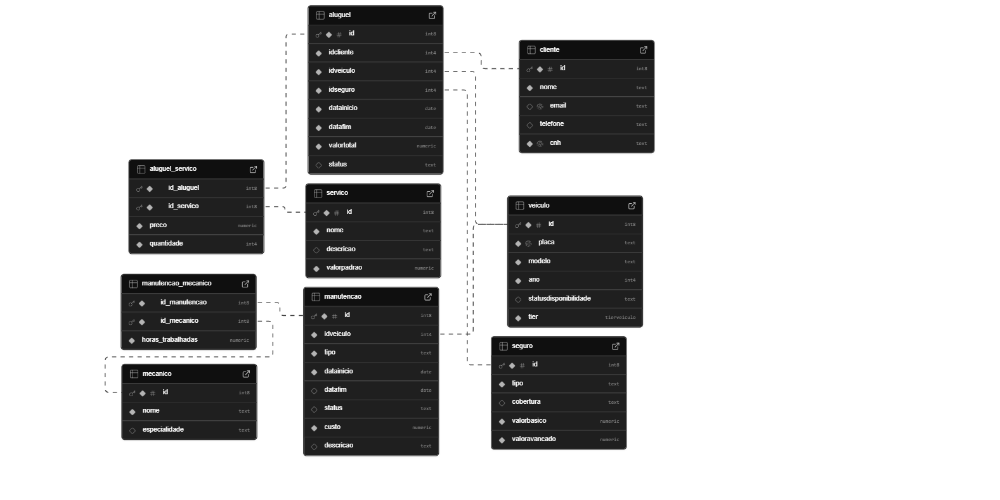

# MyMove_DB

Banco de dados e gerador de dados para uma locadora de veículos utilizando Supabase e Faker.

---

## Sumário

- [Descrição](#descrição)
- [Entidades e Relacionamentos](#entidades-e-relacionamentos)
  - [MER (Diagrama)](#mer-diagrama)
  - [Modelo Relacional (3FN)](#modelo-relacional-3fn)
- [Estrutura do Projeto](#estrutura-do-projeto)
- [Como Executar](#como-executar)
- [Queries SQL](#queries-sql)
- [Equipe](#equipe)
- [Observações](#observações)

---

## Descrição

Este projeto tem como objetivo criar o esquema de um banco de dados para uma locadora de veículos e gerar dados fictícios para as tabelas.  
O sistema armazena informações de:

- **Clientes**  
- **Veículos**  
- **Seguros**  
- **Manutenções** (incluindo relação com mecânicos)  
- **Aluguéis** (com controle de períodos para evitar sobreposição e vínculo com serviços)  
- **Serviços** associados aos aluguéis  
- **Junções N:M** com atributos para os relacionamentos:  
  - `aluguel_servico` (atributos: preço e quantidade)  
  - `manutencao_mecanico` (atributo: horas_trabalhadas)

---

## Entidades e Relacionamentos

### MER (Diagrama)


### modelo-relacional-3FN



## Estrutura do Projeto

- **main.py**  
  Código Python responsável por gerar dados fictícios e popular o banco de dados utilizando a API do Supabase.

 - **verificador.py**  
  Código Python responsável por verificar os dados fictícios do banco de dados utilizando a API do Supabase.

- **querrys.sql**  
  Contém as queries SQL utilizadas para validar e extrair informações do banco, incluindo as queries principais e as extras.

- **tabelas_iniciais.sql**  
  Script com a DDL para criação do modelo relacional utilizado no projeto.
  
- **Dados_iniciais.sql**  
  Script para ciração dos dados base necessarios para execução do código.

- **.env**  
  Arquivo que contém as chaves e URL do Supabase.  
  Exemplo de conteúdo:
  ```plaintext
  SUPABASE_URL="https://abcdefg.supabase.co"
  SUPABASE_KEY="eyJhbGciOiJIUzIOjE3NDI5NDIxMzgsImV4cC7ktYaEcBVFotK5MJMp0Qo"
  ```

## Como Executar

### Pré-requisitos

- Python 3.8 ou superior
- Conta e API do Supabase configurados

### Instalação das Dependências

No terminal, execute os seguintes comandos para instalar as dependências:

```
pip install supabase
pip install faker
pip install python-dotenv
```
### Descrição das Dependências

- **supabase**: Biblioteca para se comunicar com o **Supabase**, uma plataforma open-source que oferece banco de dados, autenticação e armazenamento de arquivos. Usada aqui para interagir com um banco de dados em tempo real e com funções backend.
  
- **faker**: Biblioteca para gerar dados falsos. É útil para testes, simulação de usuários ou dados aleatórios em ambientes de desenvolvimento.

- **python-dotenv**: Usada para carregar variáveis de ambiente a partir de um arquivo `.env`. Ideal para gerenciar configurações sensíveis (como chaves de API e credenciais de banco de dados) de forma segura sem precisar deixá-las hardcoded no código.


### Configuração do Ambiente

1. **Arquivo de Variáveis de Ambiente:**  
   Certifique-se de que o arquivo `.env` esteja na raiz do projeto. Nele acrescente as chaves de sua DB do supabase. 
   
2. **Carregamento das Variáveis:**  
   No início do arquivo `main.py`, as variáveis são carregadas utilizando o python-dotenv:
   ```python
   from dotenv import load_dotenv
   load_dotenv()
   ```
   
### Criação das Tabelas

1. Acesse o editor SQL do Supabase.
2. Copie o conteúdo do arquivo `tabelas_iniciais.sql` e `Dados_iniciais.sql`, execute-os para criar o esquema do banco de dados.

### Execução do Código

Após configurar e criar as tabelas, execute o script para popular o banco de dados:

```
python main.py
```

## Queries SQL

O projeto inclui diversas queries SQL, separadas em:

- **Queries Principais:**  
  -  Query 1: Listar todos os clientes com alugueis ativos
  - Query 2: Listar todos os alugueis de um cliente específico
  - Query 3: Listar a ultima manutenção de cada veículo
  - Query 4: Listar em ordem decrescente o lucro total de cada veículo
  - Query 5: Listar todos os veículos em algum estado específico
  - Query 6: Servicos mais utilizados nos alugueis
  - Query 7: Listar os 10 clientes que mais gastaram
  - Query 8: Mostar todas as mautenções de um status específico, com horas de trabalho e mecanicos
  - Query 9: Mostrar a media de duração dos alugueis por tier de veiculo e quantidade de alugueis
  - Query 10: Mostrar quantidade de alugueis e manutenções por modelo de veiculo

Consulte o arquivo `queries.sql` para visualizar o código completo de cada query.

### Execução das Queries

As queries SQL estão presentes no arquivo `queries.sql`. Utilize o editor SQL do Supabase para copiá-las e executá-las conforme necessário.


## Equipe

- **Pedro H. Satoru Lima Takahashi** – RA: 22.123.019-6   
- **Pedro H. Correia de Oliveira** – RA: 22.222.009-7  
- **Paulo Hudson J. da Silva** – RA: 22.222.013-9 

## Observações

- **Requisitos Técnicos:**  
  - Projeto desenvolvido em Python sem o uso de ORM.
  - Banco de dados relacional (utilizando Supabase).
  - As queries SQL foram escritas diretamente para garantir a performance e a integridade dos dados.

- **Execução e Testes:**  
  O código em `main.py` gera dados fictícios utilizando a biblioteca Faker e executa a inserção dos dados no banco.  
  Caso ocorram erros de inserção ou inconsistência nos dados, verifique as mensagens de erro exibidas no console.

- **Versionamento:**  
  Este projeto utiliza Git para o controle de versão e está hospedado no GitHub.

---

Aproveite o projeto e, caso tenha dúvidas ou encontre problemas, abra uma _issue_ no repositório ou entre em contato com a equipe.
